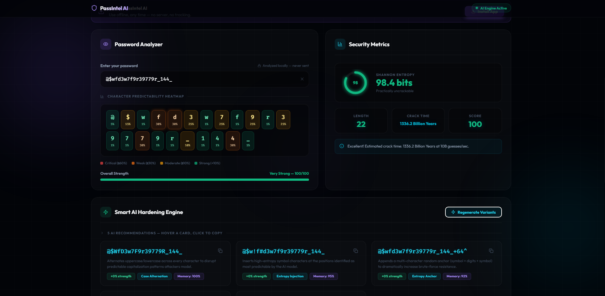
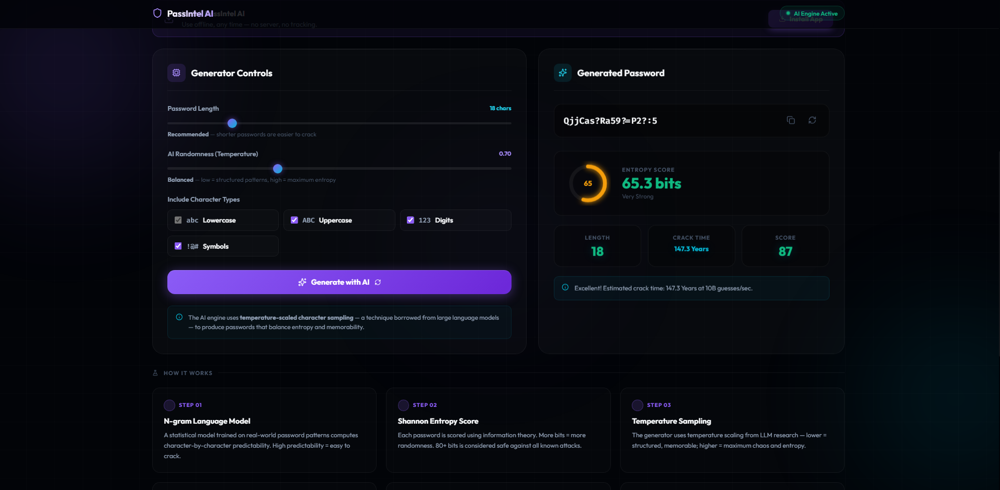
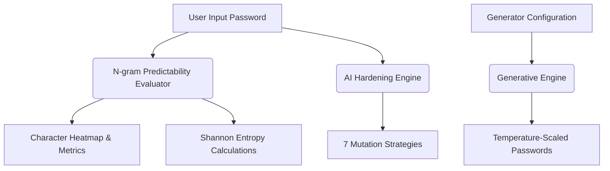

# 🛡️ PassIntel AI

[](https://react.dev)
[](https://www.typescriptlang.org)
[](https://vite.dev)
[](https://developer.mozilla.org/en-US/docs/Web/Progressive_web_apps)
[](LICENSE)

**PassIntel AI** is a professional, client-side, offline-capable password security platform that uses advanced statistical models and language modeling heuristics to evaluate password security and mutate weak passwords into cryptographically strong, memorable variants. 

Unlike traditional password strength meters that merely count character types (e.g., uppercase, lowercase, numbers, symbols), PassIntel AI models the statistical structures and transition patterns that modern hash-cracking dictionary attacks actually exploit.

---

## 🚀 Key Features

*   🔍 **Character Predictability Heatmap**: Visualizes vulnerability character-by-character. It computes conditional probabilities based on real-world breach distributions (like the *RockYou* dataset).
*   ⚖️ **Information Theory & Shannon Entropy**: Computes precise mathematical entropy bits, penalizing weak contexts and short lengths to estimate standard brute-force resistancy.
*   🧠 **AI-Powered Hardening Engine**: Generates up to seven different mutated variants targeting the weakest spots of your original password using advanced heuristics.
*   ⚡ **Controlled Generative Engine**: Simulates temperature-scaled character selection and top-k character transitions, similar to modern NLP text generation.
*   🔒 **Zero-Telemetry Client-Side Security**: Runs entirely in the browser. No APIs, no network calls, and no telemetry data are transmitted, ensuring total privacy.
*   📱 **Offline-Ready Progressive Web App (PWA)**: Installs directly onto your desktop or mobile device for native-like offline usage.

---

## 🖼️ Project Showcase

<div align="center">

**🔍 Landing & Hero**


*The AI-Powered Security Intelligence landing page with mode selection and live stats strip.*

<br/>

---

**🧪 Password Analyzer + Heatmap**



*Character-by-character predictability heatmap, Shannon Entropy ring, security metrics, and AI-hardened variant suggestions.*

<br/>

---

**⚙️ AI Generator (Hero View)**


*The AI Generator tab with temperature and character-type controls.*

<br/>

---

**📊 Generator Controls + Entropy Output**



*Temperature-scaled generation results with entropy score, crack time estimate, and "How It Works" steps.*

<br/>

---

**Navigate the screens:**

| | Screenshot | Description |
|:---:|:---:|:---|
| 1️⃣ | [Hero Landing](#-landing--hero) | AI-powered hero, mode switcher, and key stats |
| 2️⃣ | [Password Analyzer](#-password-analyzer--heatmap) | Heatmap, entropy ring, strength bar, and hardening suggestions |
| 3️⃣ | [AI Generator Hero](#️-ai-generator-hero-view) | Generator tab overview |
| 4️⃣ | [Generator Output](#-generator-controls--entropy-output) | Controls, generated password, entropy score, crack time |

</div>

---

## 🛠️ How It Works

PassIntel AI utilizes three main components working together on the client side:



### 1. The N-Gram Predictability Evaluator
Located in [evaluator.ts](file:///c:/Git/PassIntel-AI/src/ai/evaluator.ts), the evaluator simulates prediction density estimation by scanning the password sequentially. For every character $c_i$ given its preceding context $c_{1..i-1}$, it calculates the conditional probability $P(c_i \mid c_{1..i-1})$ based on:
*   Standard keyboard layout runs (e.g., `qwerty`, `12345`, repetition matching).
*   Common character transitions (e.g., lowercase letters transitioning into capitalizations, or appending common digit years like `19xx`/`20xx` at the end).
*   Common password fragments and dictionary roots (e.g., `admin`, `pass`, `login`, `love`).

The cumulative entropy is calculated as:
$$\text{Entropy} = -\sum_{i=1}^{n} \log_2 P(c_i \mid c_{1..i-1})$$

A length-based penalty is applied to passwords under 8 characters. Estimations of time-to-crack assume an offline high-performance GPU cracker testing **10 billion guesses/second**.

### 2. The Smart Password Mutator
Located in [mutator.ts](file:///c:/Git/PassIntel-AI/src/ai/mutator.ts), this engine identifies the most predictable character positions and suggests up to 7 hardened candidates. Each strategy calculates its own **Memorability Score** and **Security Improvement %** relative to the original password:

| Strategy | Description |
| :--- | :--- |
| **Leet Substitution** | Swaps letters with visually similar symbols (e.g., `e` $\rightarrow$ `3`, `o` $\rightarrow$ `0`) to disrupt standard dictionary searches. |
| **Case Alternation** | Automatically toggles capitalization of alphabetical runs. |
| **Entropy Injection** | Dynamically injects high-entropy symbols directly into the weakest positions identified by the AI. |
| **Entropy Anchor** | Appends a cryptographically strong pattern (symbol + digits + symbol) at the end. |
| **Selective Caps** | Only capitalizes letters occupying positions with higher predictability. |
| **Compound Mutation** | Combines leet-speak, forced capitalization, and entropy anchors for maximum protection. |
| **Extension** | appends short, memorable word fragments alongside symbols to boost length and entropy. |

### 3. Controlled Generative Engine
Located in [generator.ts](file:///c:/Git/PassIntel-AI/src/ai/generator.ts), the generator uses a temperature-scaled sequence model. By adjusting the **Temperature** slider (from $0.1$ to $2.0$), users can dial in password randomness:
*   **Low Temperature ($<0.5$)**: Generates highly structured, keyboard-based, and easy-to-remember patterns.
*   **Balanced Temperature ($0.5$ to $1.2$)**: Standard mix of letters, numbers, and symbols.
*   **Chaotic Temperature ($>1.2$)**: Maximum randomness and entropy, removing sequential predictions entirely.

---

## 💻 Tech Stack

*   **Framework**: [React 19](https://react.dev) with [TypeScript](https://www.typescriptlang.org)
*   **Build Utility**: [Vite 8](https://vite.dev)
*   **Styling**: Modern, responsive CSS featuring custom dark glassmorphism gradients and smooth animations.
*   **Icons**: [Lucide React](https://lucide.dev)
*   **Linter**: [Oxlint](https://github.com/oxc-project/oxc) for high-performance static analysis.

---

## ⚡ Getting Started

### Prerequisites

*   [Node.js](https://nodejs.org) (v18 or higher recommended)
*   `npm` or `yarn`

### Installation

1. Clone the repository:
   ```bash
   git clone https://github.com/atribiswas03/PassIntel-AI.git
   cd PassIntel-AI
   ```

2. Install dependencies:
   ```bash
   npm install
   ```

3. Run the development server locally:
   ```bash
   npm run dev
   ```

4. Open your browser and navigate to `http://localhost:5173`.

### Building for Production

To build the static application assets:
```bash
npm run build
```

To preview the production build locally:
```bash
npm run preview
```

---

## 📝 License

Distributed under the MIT License. See [LICENSE](file:///c:/Git/PassIntel-AI/LICENSE) for more information.
